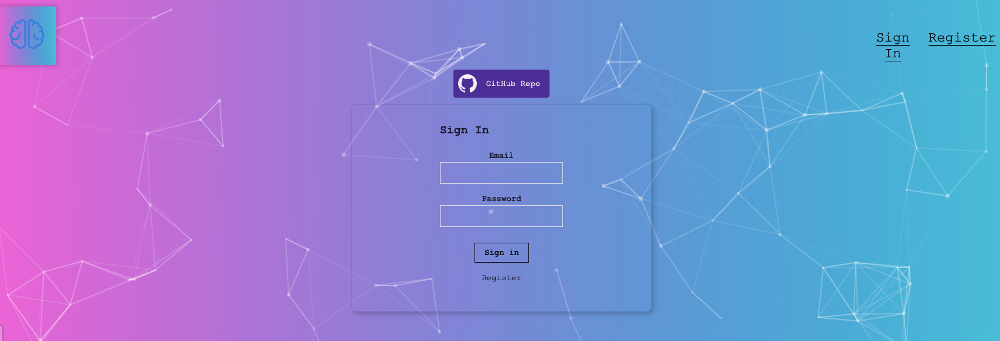
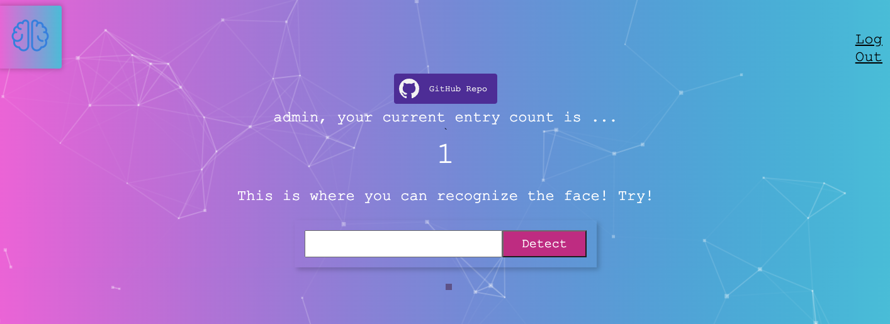
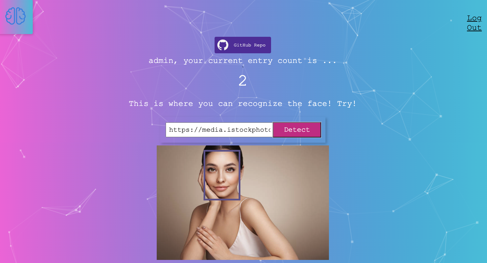

# Visiting the Website

The demo of the website is deloyed at https://render.com/. If you want to give a try to the website, please follow this [link](https://smart-brain-front-end-m2zu.onrender.com).

This repo only contains the source code for the frontend, to visit the source code for the backend, please visit [here](https://github.com/ChloeZhou1997/smart-brain-backend).

# Stack

It's a simple web application that serves to demonstrate my ability in 
- [X] programming in javascript
- [X] using JS library (Node.js for the backend, React.js for frontend)
- [X] SQL designs and queries (using postgres)
- [X] web application deployment
- [X] connect the backend server with front end web application
- [X] call API from a third party to fulfill the functionality of the web application

# What This Web Project Can Do

## Registering

Upon visting the site, you can register an account with your email address and password. 

## Counting

The web app will count how many times you have tried to detect the face from the server. 

## Detecting Face

Copy an image link from any online photo to the entry, click on Detect to detect the face. 

